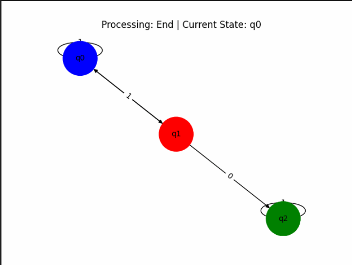

# 🧠 DFA Visualizer – Python + Graph Animation

A command-line Python application that allows you to define a **Deterministic Finite Automaton (DFA)** and **visually animate the transition steps** over a given input string using a generated GIF.

---

## ✨ Features

- 📥 Input custom DFA components (states, alphabets, transitions, start/final state)
- ✅ Checks whether a given input string is accepted by the DFA
- 🎞️ Generates an animated DFA transition graph (GIF)
- 🧠 Educational tool for visualizing how DFAs process strings

---

## 🛠️ Built With

- **Python**
- [NetworkX](https://networkx.org/) – for graph generation
- [Matplotlib](https://matplotlib.org/) – for graph rendering
- [Pillow (PIL)](https://python-pillow.org/) – for GIF creation

---

## 📂 Folder Structure

``` 
DFA-Visualizer
├── dfa_visualizer.py // Main script for DFA input, validation, and GIF generation
├── example_output.gif // Example animation output of DFA transitions
└── README.md // Project documentation 
```


---

## 🚀 How to Run

1. **Clone the repository**:

```bash
git clone https://github.com/Hunter69240/dfa-visualizer.git
cd dfa-visualizer
```

2. **Install dependencies:**

```bash
pip install networkx matplotlib pillow
```

2. **Install dependencies:**

```bash
python dfa_visualizer.py
```

## 💡 How It Works
### 🧮 Step 1: Define DFA
- Input number of states & alphabets

- Define state names, alphabet symbols

- Input the transition table

- Set the start and final state

### 🎯 Step 2: Check Strings
- Input a string to simulate

- Program checks acceptance

- Automatically creates a visual GIF showing the DFA state transitions

## 📸 Example Output


## 📜 Code Explanation


### valid_with_steps(...)
- Simulates the DFA transition step-by-step

- Tracks each (current_state, char) transition

- Returns whether string is accepted and a list of steps

### plot_to_gif(...)
- Builds DFA as a directed graph using networkx

- Colors:

  - Start/Final: 🟢 Green

   - Others: 🔴 Red

    - Active: 🔵 Blue

- Saves each transition as a frame

- Compiles all frames into a .gif using Pillow

## 📚 Educational Use
### Perfect for:

- Visualizing DFA execution

- Learning Automata Theory


- Classroom demonstrations

## Collaborators:
https://github.com/NikSterPrime
https://github.com/anoopckulkarni


